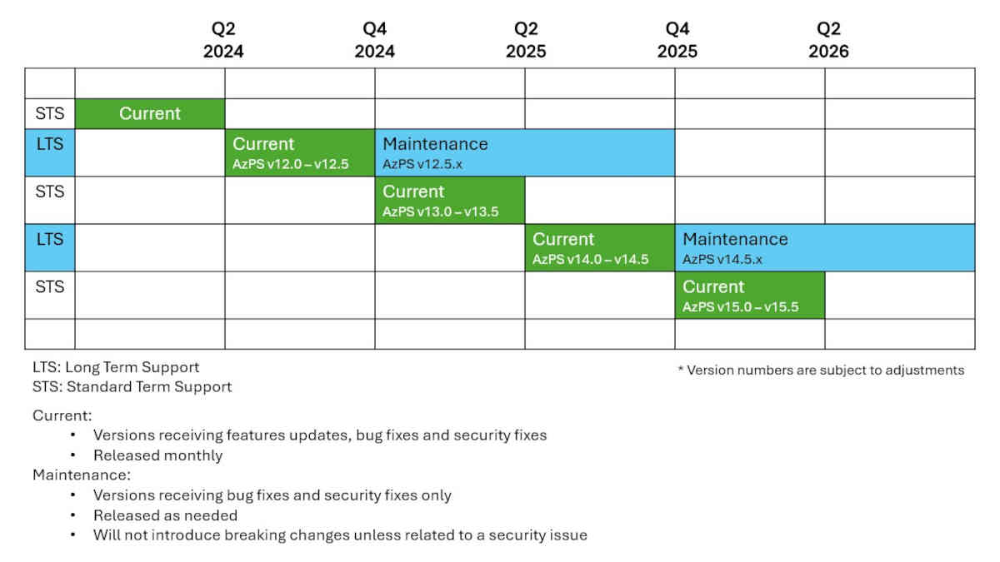

# Azure PowerShell Support Lifecycle

Every Microsoft product has a lifecycle. The lifecycle begins when a product is released and ends
when it's no longer supported. Knowing key dates in this lifecycle helps you make informed decisions
about when to upgrade or make other changes to your software.

The Azure PowerShell support lifecycle is designed to provide clarity and predictability for
customers regarding support for each release. The length of time and degree of support vary based on
a few qualifications. The Azure PowerShell support lifecycle follows Microsoft's
[Modern Lifecycle Policy][modern-lifecycle-policy] unless specified otherwise in this article.

_"Azure PowerShell"_ consists of the PowerShell module named _"Az"_ and the dependent PowerShell
modules signed by _"Microsoft Corporation"_. For the current list of Az PowerShell modules, see
[Azure PowerShell Modules][azure-powershell-modules].

## Versioning

Azure PowerShell follows [Semantic Versioning][semantic-versioning] for version numbering. Semantic
versioning is a system that uses a three-part number format: `major.minor.patch`.

- **Major versions:** Breaking changes, including architectural and fundamental design changes.
- **Minor versions:** Backwards compatible feature updates and improved Azure services coverage.
- **Patch versions:** Backwards compatible security fixes without new features or functionality
  changes.

### Module version types

Releases of Azure PowerShell can include the following types of versions:

- **Generally available (GA):** Modules version 1.0.0 and higher without _preview_ in the version.
  Adheres to breaking change policy.
- **Preview:** Modules less than version 1.0.0. Don't adhere to breaking change policy.
- **Feature preview:** Modules version 1.0.0 and higher with _preview_ in the version. Don't adhere
  to breaking change policy.

> [!CAUTION]
> Preview and Feature preview versions aren't recommended for production environments.

There are two Az PowerShell modules:

- [Az](https://www.powershellgallery.com/packages/Az/). Installs all GA service modules for managing
  Azure resources.
- [AzPreview](https://www.powershellgallery.com/packages/AzPreview/). Installs all GA and preview
  modules for managing Azure resources. Doesn't include feature preview modules.

The **AzPreview** module is always the same version and is released at the same time as the **Az**
module.

## Release cadence

Azure PowerShell is updated monthly, with up to two annual releases introducing breaking changes.
This release cadence is designed to provide customers with predictable release dates, empowering
businesses, developers, and the community to make strategic decisions when planning their roadmaps.

> [!WARNING]
> Before upgrading to a major breaking change version of the **Az** PowerShell module, you should
> [**review the migration guide**](https://aka.ms/azps-migration-latest).

## Support of releases

Azure PowerShell ships two types of generally available releases. Customers can choose Standard Term
Support (STS) or Long Term Support (LTS) releases. The quality of all releases is the same. The only
difference is the length of support.

- **Standard Term Support (STS) releases**

  - Odd-numbered major versions are STS releases.
  - STS versions are supported until the next major release of Azure PowerShell.
  - Supported for approximately six months from the original major version release date.
  - Receives minor version and patch updates until out of support.

- **Long Term Support (LTS) releases**

  - Even-numbered major versions are LTS releases, beginning with **Az** 12.0.0.
  - The final version of each LTS release is supported until the second subsequent STS version is
    released.
  - Supported for approximately 18 months from the original major version release date.
  - Receives minor version updates _only for the first 6 months_ and patch updates until out of
    support.

> [!IMPORTANT]
> You must install the latest minor and patch version to qualify for support.

The following image illustrates the release cadence and support lifecycle of Azure PowerShell for
STS and LTS releases.

The following table provides examples of how the release cadence correlates with the support
lifecycle:

> [!NOTE]
> The dates in the following table are for example purposes only. The actual release dates vary.

| Version number | Release schedule | Breaking changes | Release type | Support type | Supported until version |
| -------------- | ---------------- | ---------------- | ------------ | ------------ | ----------------------- |
| 12.5.0         | October 2024     |                  | Minor        | LTS          | _**15.0.0**_            |
| 14.0.0         | May 2025         | ![Yes][1]        | Major        | LTS          | 14.1.0                  |
| 14.1.0         | June 2025        |                  | Minor        | LTS          | 14.2.0                  |
| 14.2.0         | July 2025        |                  | Minor        | LTS          | 14.3.0                  |
| 14.3.0         | August 2025      |                  | Minor        | LTS          | 14.4.0                  |
| 14.4.0         | September 2025   |                  | Minor        | LTS          | 14.5.0                  |
| 14.5.0         | October 2025     |                  | Minor        | LTS          | _**17.0.0**_            |
| 15.0.0         | November 2025    | ![Yes][1]        | Major        | STS          | 15.1.0                  |
| 15.1.0         | December 2025    |                  | Minor        | STS          | 15.2.0                  |
| 15.2.0         | January 2026     |                  | Minor        | STS          | 15.3.0                  |
| 15.3.0         | February 2026    |                  | Minor        | STS          | 15.4.0                  |
| 15.4.0         | March 2026       |                  | Minor        | STS          | 15.5.0                  |
| 15.5.0         | April 2026       |                  | Minor        | STS          | _**16.0.0**_            |
| 16.0.0         | May 2026         | ![Yes][1]        | Major        | LTS          | 16.1.0                  |
| 16.1.0         | June 2026        |                  | Minor        | LTS          | 16.2.0                  |
| 16.2.0         | July 2026        |                  | Minor        | LTS          | 16.3.0                  |
| 16.3.0         | August 2026      |                  | Minor        | LTS          | 16.4.0                  |
| 16.4.0         | September 2026   |                  | Minor        | LTS          | 16.5.0                  |
| 16.5.0         | October 2026     |                  | Minor        | LTS          | _**19.0.0**_            |

- Examples:
  - To qualify for support, you must update to 14.1.0 when released if you have **Az** 14.0.0
    installed.
  - If **Az** 14.5.0 is the final release of **Az** version 14, it's supported until the release of
    **Az** 17.0.0.
  - When **Az** 14.0.0 is released, **Az** version 13 is no longer supported.

## Breaking changes

Major version releases of Azure PowerShell introduce breaking changes and occur up to two times per
year. Various types of breaking changes can occur in cmdlets. For more information, see
[Breaking Change Definition][breaking-change-definition]. Breaking changes may occur at any point
for preview and feature preview modules. Non-GA modules aren't required to adhere to breaking change
policies.

### Breaking change warning messages

Breaking change warning messages allow Azure PowerShell cmdlet authors to communicate upcoming
breaking changes with end users.

### Suppress breaking change warning messages

To suppress breaking change warning messages, see
[Configure breaking change warning messages in global settings](configure-global-settings.md#breaking-change-warning-messages).

For more information, see
[Breaking Changes Attribute Help](https://github.com/Azure/azure-powershell/blob/preview/documentation/breaking-changes/breaking-changes-attribute-help.md#supress-the-breaking-change-messages-at-runtime).

### List of breaking changes

For detailed information about breaking changes in major releases of the **Az** PowerShell module,
see the following articles.

- [Upcoming breaking changes](upcoming-breaking-changes.md)
- [Az 14.0.0 breaking changes](migrate-az-14.0.0.md)
- [Az 13.0.0 breaking changes](migrate-az-13.0.0.md)
- [Az 12.0.0 breaking changes](migrate-az-12.0.0.md)
- [Az 11.0.0 breaking changes](migrate-az-11.0.0.md)
- [Az 10.0.0 breaking changes](migrate-az-10.0.0.md)
- [Az 9.0.1 breaking changes](migrate-az-9.0.1.md)
- [Az 8.0.0 breaking changes](migrate-az-8.0.0.md)
- [Az 7.0.0 breaking changes](migrate-az-7.0.0.md)
- [Az 6.0.0 breaking changes](migrate-az-6.0.0.md)
- [Az 5.0.0 breaking changes](migrate-az-5.0.0.md)
- [Az 4.1.0 breaking changes](migrate-az-4.1.0.md)
- [Az 3.0.0 breaking changes](migrate-az-3.0.0.md)
- [Az 2.0.0 breaking changes](migrate-az-2.0.0.md)

## Supported environments

The following table identifies the supported platforms for the Azure PowerShell modules.

> [!NOTE]
> Azure PowerShell is supported only on versions of PowerShell that are still within their support
> lifecycle. For details, refer to the [PowerShell end-of-support dates][powershell-support-dates].

|              Azure PowerShell               | PowerShell   7.x (any supported version) | Windows PowerShell   5.1 |
| ------------------------------------------- | :------------------------------------------: | :--------------------------: |
| ![Supported][1] Az 14.x                     |               ![Supported][1]                |       ![Supported][1]        |
| ![Out of Support][4] Az 13.x                |             ![Out of Support][4]             |     ![Out of Support][4]     |
| ![Supported][1] Az 12.x                     |               ![Supported][1]                |       ![Supported][1]        |
| ![Out of Support][4] <= Az 11.x             |             ![Out of Support][4]             |     ![Out of Support][4]     |
| ![Out of Support][4] AzureRM (all versions) |             ![Not Supported][3]              |     ![Out of Support][4]     |
| ![Out of Support][4] Azure (all versions)   |             ![Not Supported][3]              |     ![Out of Support][4]     |

- The ![Supported][1] icon indicates supported version combinations of Azure PowerShell and
  PowerShell.
- The ![Out of Support][4] icon indicates version combinations of Azure PowerShell and PowerShell
  that are no longer supported.
- The ![Not Supported][3] icon indicates unsupported version combinations of Azure PowerShell and
  PowerShell.

## Azure PowerShell application ID guidance

The Azure PowerShell application ID is reserved exclusively for that tool and must not be used for
other purposes. For questions or concerns, use the official support channels.

> [!NOTE]
> This application ID is subject to change or limitation at any time, and its continued availability
> isn't guaranteed.

## Other resources

- [Azure PowerShell releases demystified][releases-demystified]

<!-- link references -->

[modern-lifecycle-policy]: /lifecycle/policies/modern
[azure-powershell-modules]: https://github.com/Azure/azure-powershell/blob/master/documentation/azure-powershell-modules.md
[semantic-versioning]: https://semver.org/
[breaking-change-definition]: https://github.com/Azure/azure-powershell/blob/preview/documentation/breaking-changes/breaking-changes-definition.md
[releases-demystified]: https://techcommunity.microsoft.com/t5/azure-tools-blog/azure-powershell-releases-demystified/ba-p/1609863
[powershell-support-dates]: /powershell/scripting/install/powershell-support-lifecycle#powershell-end-of-support-dates
[1]: ../../media/shared/check-mark-button_2705.svg
[2]: ../../media/shared/construction-sign_1f6a7.svg
[3]: ../../media/shared/cross-mark_274c.svg
[4]: ../../media/shared/large-yellow-circle_1f7e1.svg
